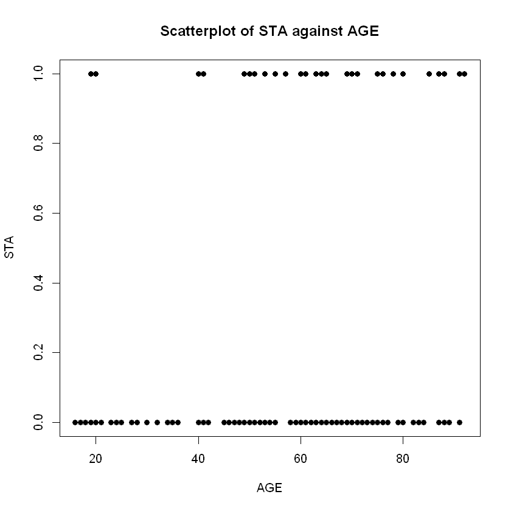
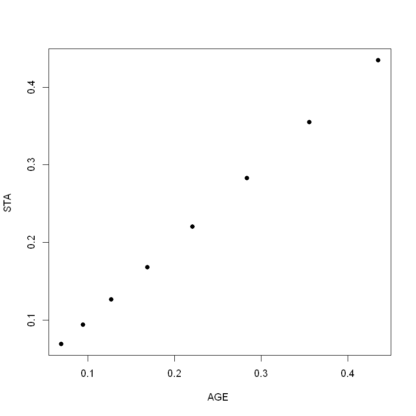
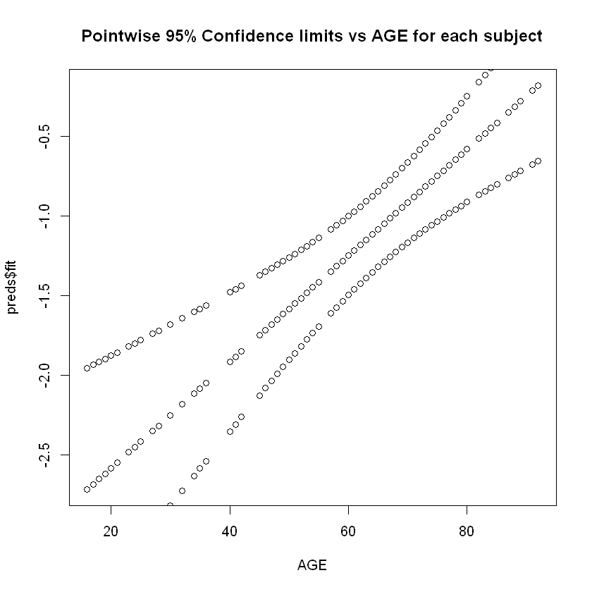
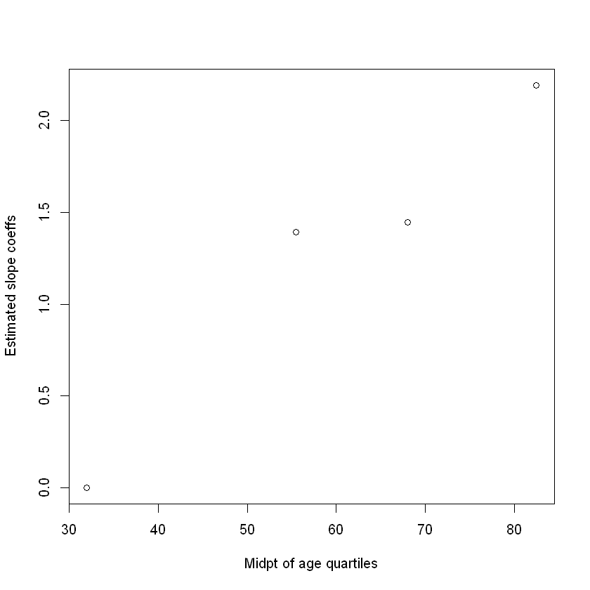

```R

  #1a) 
  data = read.table("D:/Gerrie/All modules taken/ST3243/Project/icu.data.s11.txt",sep="\t", header=FALSE) 
  colnames(data) <- c("ID", "STA", "AGE", "SEX", "RACE", "SER", "CAN", "CRN", "INF", "CPR", "SYS", "HRA", "PRE", 'TYP', "FRA", "PO2", "PH", "PCO", 'BIC', 'CRE', 'LOC')
  attach(data)
  
  #b) 
  plot(AGE, STA, main='Scatterplot of STA against AGE', xlab='AGE', ylab='STA', pch=19) 
  #c) 
  h1 = sum(STA[AGE> 14 & AGE <= 24])
  h2 = sum(STA[AGE> 24 & AGE <= 34])
  h3 = sum(STA[AGE> 34 & AGE <= 44])
  h4 = sum(STA[AGE> 44 & AGE <= 54])
  h5 = sum(STA[AGE> 54 & AGE <= 64])
  h6 = sum(STA[AGE> 64 & AGE <= 74])
  h7 = sum(STA[AGE> 74 & AGE <= 84])
  h8 = sum(STA[AGE> 84 & AGE <= 94])
  
  x1 = sum(AGE> 14 & AGE <= 24)
  x2 = sum(AGE> 24 & AGE <= 34)
  x3 = sum(AGE> 34 & AGE <= 44)
  x4 = sum(AGE> 44 & AGE <= 54)
  x5 = sum(AGE> 54 & AGE <= 64)
  x6 = sum(AGE> 64 & AGE <= 74)
  x7 = sum(AGE> 74 & AGE <= 84)
  x8 = sum(AGE> 84 & AGE <= 94)
  
  mean_STA <- c(h1/x1, h2/x2, h3/x3, h4/x4, h5/x5, h6/x6, h7/x7, h8/x8) 
  midpt_AGE <- c((15+24)/2, (25+34)/2, (35+44)/2, (45+54)/2, (55+64)/2, (65+74)/2, (75+84)/2, (85+94)/2) 
  
  plot(midpt_AGE, mean_STA, main="Scatterplot of mean_STA against midpt_AGE", xlab="AGE ", ylab="STA ", pch=13)
  #d) 
  data_glm <- glm(STA~AGE, family=binomial(link='logit'), data=data) 
  summary(data_glm)
  
  
  vector_age_fittedvals <- character()
  values <- AGE
  for (i in 1:length(AGE)){
    values[i] <- 1/(1+exp(3.25069-0.033394*values[i]))
    vector_age_fittedvals[i] <- values[i]
  }
  
  
  plot(AGE,vector_age_fittedvals, xlab="AGE ", ylab="STA ", pch=16)
  
  vector_midptage_fittedvals <- character()
  
  for (i in 1:length(midpt_AGE)){
    midpt_AGE[i] <- 1/(1+exp(3.25069-0.033394*midpt_AGE[i]))
    vector_midptage_fittedvals[i] <- midpt_AGE[i]
  }
  
  
  plot(midpt_AGE,vector_midptage_fittedvals, xlab="AGE ", ylab="STA ", pch=16)
  
  #g) 
  confint(data_glm, level=0.95) 
  
  #i) 
  agedata = data.frame(AGE) 
  preds = predict(data_glm, type='link', agedata, se=TRUE) 
  upper = preds$fit + 1.96*preds$se.fit 
  preds 
  # the values from $se.fit are the standard errors 
  lower = preds$fit - 1.96*preds$se.fit 
  plot(AGE, preds$fit, main='Pointwise 95% Confidence limits vs AGE for each subject') 
  for (k in 1:nrow(data)) {
    points(c(AGE[k], AGE[k]), c(lower[k], upper[k]))
  }
  

    #2a) 
    table(data$STA, data$CPR) 
  odds_ratio = (296*16) / (11*77)
  ln_odds_ratio = log(odds_ratio, base = exp(1))
  ln_odds_ratio
  
  data_glm <- glm(STA~CPR, family=binomial(link='logit'), data=data) 
  summary(data_glm)
  
  squareroot_of_lnOR = sqrt(1/296 + 1/11 + 1/77 + 1/16) 
  squareroot_of_lnOR
  
  #calculation for 95% CI for OR below 
  upper_limit = exp(ln_odds_ratio + 1.96*squareroot_of_lnOR)
  upper_limit
  
  lower_limit = exp(ln_odds_ratio - 1.96*squareroot_of_lnOR)
  lower_limit
  
  
    #b) 
    CPR_recoded = ifelse(CPR==0, 4, 2)
  CPR_recoded
  data_glm <- glm(STA ~ CPR_recoded, family=binomial(link='logit'), data=data) 
  summary(data_glm)
  
#   /*logit difference of CPR=yes and CPR=no
  
#   ln(OR(CPR=yes,CPR=no)) = (beta0 + beta1*yes) - (beta0 + beta1*no) 
#   = beta1*(yes - no) 
#   = -0.8606*(2-4) 
#   = 1.7212
  
#   Since we know ln(OR) = coefficient of beta1 then just calculate 95% CI 
#   normally which is = exp(1.7212 +/- 0.4120)
#   */
    #c) 
    table(STA,RACE)
  x = factor(RACE) 
  is.factor(x) #check if x is factor 
  data_glm = glm(STA~x, family=binomial(link='logit'), data=data) 
  
  #d) 

dummy1 = ifelse((AGE >=16 & AGE <=48), 1, 0) 
dummy2 = ifelse((AGE >=49 & AGE <=63), 1, 0) 
dummy3 = ifelse((AGE >=64 & AGE <=73), 1, 0) 
dummy4 = ifelse((AGE >=74 & AGE <=92), 1, 0) 
AGE <- as.factor(AGE) 
x = glm(STA~dummy2+dummy3+dummy4, family=binomial(link='logit'), data=data) 
summary(x) 

col1=c(0,1.3934,1.4447, 2.1919)
col2=c(32,55.5,68, 82.5)
tables=cbind(col1,col2)
plot(col2,col1, xlab='Midpt of age quartiles',ylab='Estimated slope coeffs')

#e) 
l = glm(STA~CRN, family=binomial(link='logit'), data=data) 
summary(l) 
exp(coef(l)) 

g = glm(STA~CRN+AGE, family=binomial(link='logit'), data=data) 
summary(g) 
library(effects) 
q = glm(STA~CRN+AGE, family=binomial(link='logit'), data=data) 
plot(allEffects(q))
#consider interaction term in the model now
r = glm(STA~CRN+AGE+CRN:AGE, data=data, family=binomial(link='logit')) 
plot(allEffects(r))
summary(q) 
summary(g) 
summary(r) 
anova(g, q, test='Chi') 
```





    
    Call:
    glm(formula = STA ~ AGE, family = binomial(link = "logit"), data = data)
    
    Deviance Residuals: 
        Min       1Q   Median       3Q      Max  
    -1.0889  -0.7984  -0.6211  -0.3637   2.3181  
    
    Coefficients:
                 Estimate Std. Error z value Pr(>|z|)    
    (Intercept) -3.250690   0.507019  -6.411 1.44e-10 ***
    AGE          0.033394   0.007631   4.376 1.21e-05 ***
    ---
    Signif. codes:  0 '***' 0.001 '**' 0.01 '*' 0.05 '.' 0.1 ' ' 1
    
    (Dispersion parameter for binomial family taken to be 1)
    
        Null deviance: 433.82  on 399  degrees of freedom
    Residual deviance: 410.92  on 398  degrees of freedom
    AIC: 414.92
    
    Number of Fisher Scoring iterations: 4
    


    Waiting for profiling to be done...
    


<table>
<thead><tr><th></th><th scope=col>2.5 %</th><th scope=col>97.5 %</th></tr></thead>
<tbody>
	<tr><th scope=row>(Intercept)</th><td>-4.3037603 </td><td>-2.31001123</td></tr>
	<tr><th scope=row>AGE</th><td> 0.0190321 </td><td> 0.04903466</td></tr>
</tbody>
</table>


<dl>
	<dt>$fit</dt>
		<dd><dl class=dl-horizontal>
	<dt>1</dt>
		<dd>-1.58099653314825</dd>
	<dt>2</dt>
		<dd>-1.51420879031292</dd>
	<dt>3</dt>
		<dd>-1.61439040456592</dd>
	<dt>4</dt>
		<dd>-1.88154137590725</dd>
	<dt>5</dt>
		<dd>-0.979906847630259</dd>
	<dt>6</dt>
		<dd>-2.71638816134891</dd>
	<dt>7</dt>
		<dd>-2.61620654709591</dd>
	<dt>8</dt>
		<dd>-1.54760266173059</dd>
	<dt>9</dt>
		<dd>-1.24705781897159</dd>
	<dt>10</dt>
		<dd>-0.779543619124262</dd>
	<dt>11</dt>
		<dd>-0.579180390618263</dd>
	<dt>12</dt>
		<dd>-1.48081491889526</dd>
	<dt>13</dt>
		<dd>-1.14687620471859</dd>
	<dt>14</dt>
		<dd>-0.345423290694598</dd>
	<dt>15</dt>
		<dd>-1.48081491889526</dd>
	<dt>16</dt>
		<dd>-2.41584331858991</dd>
	<dt>17</dt>
		<dd>-0.979906847630259</dd>
	<dt>18</dt>
		<dd>-2.71638816134891</dd>
	<dt>19</dt>
		<dd>-2.58281267567825</dd>
	<dt>20</dt>
		<dd>-0.946512976212593</dd>
	<dt>21</dt>
		<dd>-0.87972523337726</dd>
	<dt>22</dt>
		<dd>-1.11348233330092</dd>
	<dt>23</dt>
		<dd>-2.71638816134891</dd>
	<dt>24</dt>
		<dd>-0.612574262035929</dd>
	<dt>25</dt>
		<dd>-0.178453933606267</dd>
	<dt>26</dt>
		<dd>-0.712755876288929</dd>
	<dt>27</dt>
		<dd>-1.24705781897159</dd>
	<dt>28</dt>
		<dd>-0.412211033529931</dd>
	<dt>29</dt>
		<dd>-1.54760266173059</dd>
	<dt>30</dt>
		<dd>-2.64960041851358</dd>
	<dt>31</dt>
		<dd>-1.44742104747759</dd>
	<dt>32</dt>
		<dd>-0.946512976212593</dd>
	<dt>33</dt>
		<dd>-1.91493524732492</dd>
	<dt>34</dt>
		<dd>-0.579180390618263</dd>
	<dt>35</dt>
		<dd>-2.64960041851358</dd>
	<dt>36</dt>
		<dd>-1.68117814740125</dd>
	<dt>37</dt>
		<dd>-0.746149747706595</dd>
	<dt>38</dt>
		<dd>-0.87972523337726</dd>
	<dt>39</dt>
		<dd>-1.31384556180692</dd>
	<dt>40</dt>
		<dd>-1.01330071904793</dd>
	<dt>41</dt>
		<dd>-1.74796589023659</dd>
	<dt>42</dt>
		<dd>-1.61439040456592</dd>
	<dt>43</dt>
		<dd>-1.68117814740125</dd>
	<dt>44</dt>
		<dd>-0.913119104794927</dd>
	<dt>45</dt>
		<dd>-2.04851073299558</dd>
	<dt>46</dt>
		<dd>-1.01330071904793</dd>
	<dt>47</dt>
		<dd>-1.61439040456592</dd>
	<dt>48</dt>
		<dd>-2.61620654709591</dd>
	<dt>49</dt>
		<dd>-0.478998776365264</dd>
	<dt>50</dt>
		<dd>-0.412211033529931</dd>
	<dt>51</dt>
		<dd>-0.979906847630259</dd>
	<dt>52</dt>
		<dd>-1.04669459046559</dd>
	<dt>53</dt>
		<dd>-0.679362004871262</dd>
	<dt>54</dt>
		<dd>-2.54941880426058</dd>
	<dt>55</dt>
		<dd>-1.91493524732492</dd>
	<dt>56</dt>
		<dd>-2.41584331858991</dd>
	<dt>57</dt>
		<dd>-1.21366394755392</dd>
	<dt>58</dt>
		<dd>-2.48263106142525</dd>
	<dt>59</dt>
		<dd>-0.946512976212593</dd>
	<dt>60</dt>
		<dd>-2.11529847583092</dd>
	<dt>61</dt>
		<dd>-1.41402717605992</dd>
	<dt>62</dt>
		<dd>-2.18208621866625</dd>
	<dt>63</dt>
		<dd>-0.445604904947598</dd>
	<dt>64</dt>
		<dd>-0.779543619124262</dd>
	<dt>65</dt>
		<dd>-0.478998776365264</dd>
	<dt>66</dt>
		<dd>-1.34723943322459</dd>
	<dt>67</dt>
		<dd>-0.579180390618263</dd>
	<dt>68</dt>
		<dd>-0.746149747706595</dd>
	<dt>69</dt>
		<dd>-1.18027007613626</dd>
	<dt>70</dt>
		<dd>-0.746149747706595</dd>
	<dt>71</dt>
		<dd>-0.679362004871262</dd>
	<dt>72</dt>
		<dd>-1.21366394755392</dd>
	<dt>73</dt>
		<dd>-1.91493524732492</dd>
	<dt>74</dt>
		<dd>-1.24705781897159</dd>
	<dt>75</dt>
		<dd>-0.579180390618263</dd>
	<dt>76</dt>
		<dd>-0.579180390618263</dd>
	<dt>77</dt>
		<dd>-2.68299428993124</dd>
	<dt>78</dt>
		<dd>-2.61620654709591</dd>
	<dt>79</dt>
		<dd>-1.24705781897159</dd>
	<dt>80</dt>
		<dd>-1.34723943322459</dd>
	<dt>81</dt>
		<dd>-0.746149747706595</dd>
	<dt>82</dt>
		<dd>-0.913119104794927</dd>
	<dt>83</dt>
		<dd>-1.18027007613626</dd>
	<dt>84</dt>
		<dd>-0.779543619124262</dd>
	<dt>85</dt>
		<dd>-0.712755876288929</dd>
	<dt>86</dt>
		<dd>-1.24705781897159</dd>
	<dt>87</dt>
		<dd>-0.779543619124262</dd>
	<dt>88</dt>
		<dd>-0.779543619124262</dd>
	<dt>89</dt>
		<dd>-2.41584331858991</dd>
	<dt>90</dt>
		<dd>-0.679362004871262</dd>
	<dt>91</dt>
		<dd>-0.979906847630259</dd>
	<dt>92</dt>
		<dd>-1.04669459046559</dd>
	<dt>93</dt>
		<dd>-0.345423290694598</dd>
	<dt>94</dt>
		<dd>-1.24705781897159</dd>
	<dt>95</dt>
		<dd>-1.08008846188326</dd>
	<dt>96</dt>
		<dd>-0.211847805023933</dd>
	<dt>97</dt>
		<dd>-1.41402717605992</dd>
	<dt>98</dt>
		<dd>-1.11348233330092</dd>
	<dt>99</dt>
		<dd>-0.746149747706595</dd>
	<dt>100</dt>
		<dd>-2.08190460441325</dd>
	<dt>101</dt>
		<dd>-0.645968133453596</dd>
	<dt>102</dt>
		<dd>-1.58099653314825</dd>
	<dt>103</dt>
		<dd>-0.746149747706595</dd>
	<dt>104</dt>
		<dd>-0.87972523337726</dd>
	<dt>105</dt>
		<dd>-2.68299428993124</dd>
	<dt>106</dt>
		<dd>-1.41402717605992</dd>
	<dt>107</dt>
		<dd>-0.946512976212593</dd>
	<dt>108</dt>
		<dd>-0.913119104794927</dd>
	<dt>109</dt>
		<dd>-1.58099653314825</dd>
	<dt>110</dt>
		<dd>-0.913119104794927</dd>
	<dt>111</dt>
		<dd>-0.345423290694598</dd>
	<dt>112</dt>
		<dd>-0.445604904947598</dd>
	<dt>113</dt>
		<dd>-0.746149747706595</dd>
	<dt>114</dt>
		<dd>-1.24705781897159</dd>
	<dt>115</dt>
		<dd>-2.41584331858991</dd>
	<dt>116</dt>
		<dd>-1.48081491889526</dd>
	<dt>117</dt>
		<dd>-0.812937490541928</dd>
	<dt>118</dt>
		<dd>-1.24705781897159</dd>
	<dt>119</dt>
		<dd>-0.87972523337726</dd>
	<dt>120</dt>
		<dd>-1.14687620471859</dd>
	<dt>121</dt>
		<dd>-1.58099653314825</dd>
	<dt>122</dt>
		<dd>-2.54941880426058</dd>
	<dt>123</dt>
		<dd>-0.445604904947598</dd>
	<dt>124</dt>
		<dd>-1.91493524732492</dd>
	<dt>125</dt>
		<dd>-0.278635547859266</dd>
	<dt>126</dt>
		<dd>-0.211847805023933</dd>
	<dt>127</dt>
		<dd>-2.34905557575458</dd>
	<dt>128</dt>
		<dd>-0.913119104794927</dd>
	<dt>129</dt>
		<dd>-1.08008846188326</dd>
	<dt>130</dt>
		<dd>-2.61620654709591</dd>
	<dt>131</dt>
		<dd>-0.913119104794927</dd>
	<dt>132</dt>
		<dd>-0.812937490541928</dd>
	<dt>133</dt>
		<dd>-1.04669459046559</dd>
	<dt>134</dt>
		<dd>-2.18208621866625</dd>
	<dt>135</dt>
		<dd>-2.54941880426058</dd>
	<dt>136</dt>
		<dd>-2.71638816134891</dd>
	<dt>137</dt>
		<dd>-0.579180390618263</dd>
	<dt>138</dt>
		<dd>-1.91493524732492</dd>
	<dt>139</dt>
		<dd>-1.04669459046559</dd>
	<dt>140</dt>
		<dd>-0.712755876288929</dd>
	<dt>141</dt>
		<dd>-1.08008846188326</dd>
	<dt>142</dt>
		<dd>-1.44742104747759</dd>
	<dt>143</dt>
		<dd>-0.679362004871262</dd>
	<dt>144</dt>
		<dd>-1.18027007613626</dd>
	<dt>145</dt>
		<dd>-2.48263106142525</dd>
	<dt>146</dt>
		<dd>-1.68117814740125</dd>
	<dt>147</dt>
		<dd>-2.61620654709591</dd>
	<dt>148</dt>
		<dd>-1.54760266173059</dd>
	<dt>149</dt>
		<dd>-1.48081491889526</dd>
	<dt>150</dt>
		<dd>-1.48081491889526</dd>
	<dt>151</dt>
		<dd>-1.34723943322459</dd>
	<dt>152</dt>
		<dd>-0.746149747706595</dd>
	<dt>153</dt>
		<dd>-0.946512976212593</dd>
	<dt>154</dt>
		<dd>-2.04851073299558</dd>
	<dt>155</dt>
		<dd>-2.34905557575458</dd>
	<dt>156</dt>
		<dd>-2.71638816134891</dd>
	<dt>157</dt>
		<dd>-0.211847805023933</dd>
	<dt>158</dt>
		<dd>-0.512392647782931</dd>
	<dt>159</dt>
		<dd>-2.31566170433691</dd>
	<dt>160</dt>
		<dd>-2.61620654709591</dd>
	<dt>161</dt>
		<dd>-2.61620654709591</dd>
	<dt>162</dt>
		<dd>-1.21366394755392</dd>
	<dt>163</dt>
		<dd>-1.71457201881892</dd>
	<dt>164</dt>
		<dd>-2.68299428993124</dd>
	<dt>165</dt>
		<dd>-2.64960041851358</dd>
	<dt>166</dt>
		<dd>-2.61620654709591</dd>
	<dt>167</dt>
		<dd>-1.14687620471859</dd>
	<dt>168</dt>
		<dd>-0.645968133453596</dd>
	<dt>169</dt>
		<dd>-1.01330071904793</dd>
	<dt>170</dt>
		<dd>-1.61439040456592</dd>
	<dt>171</dt>
		<dd>-1.21366394755392</dd>
	<dt>172</dt>
		<dd>-0.946512976212593</dd>
	<dt>173</dt>
		<dd>-0.946512976212593</dd>
	<dt>174</dt>
		<dd>-0.412211033529931</dd>
	<dt>175</dt>
		<dd>-1.21366394755392</dd>
	<dt>176</dt>
		<dd>-1.01330071904793</dd>
	<dt>177</dt>
		<dd>-0.979906847630259</dd>
	<dt>178</dt>
		<dd>-1.41402717605992</dd>
	<dt>179</dt>
		<dd>-0.612574262035929</dd>
	<dt>180</dt>
		<dd>-1.41402717605992</dd>
	<dt>181</dt>
		<dd>-0.779543619124262</dd>
	<dt>182</dt>
		<dd>-0.812937490541928</dd>
	<dt>183</dt>
		<dd>-1.11348233330092</dd>
	<dt>184</dt>
		<dd>-0.979906847630259</dd>
	<dt>185</dt>
		<dd>-0.512392647782931</dd>
	<dt>186</dt>
		<dd>-0.946512976212593</dd>
	<dt>187</dt>
		<dd>-2.44923719000758</dd>
	<dt>188</dt>
		<dd>-1.24705781897159</dd>
	<dt>189</dt>
		<dd>-1.68117814740125</dd>
	<dt>190</dt>
		<dd>-1.21366394755392</dd>
	<dt>191</dt>
		<dd>-2.64960041851358</dd>
	<dt>192</dt>
		<dd>-1.24705781897159</dd>
	<dt>193</dt>
		<dd>-0.87972523337726</dd>
	<dt>194</dt>
		<dd>-0.779543619124262</dd>
	<dt>195</dt>
		<dd>-2.18208621866625</dd>
	<dt>196</dt>
		<dd>-0.679362004871262</dd>
	<dt>197</dt>
		<dd>-2.04851073299558</dd>
	<dt>198</dt>
		<dd>-1.58099653314825</dd>
	<dt>199</dt>
		<dd>-0.746149747706595</dd>
	<dt>200</dt>
		<dd>-0.679362004871262</dd>
	<dt>201</dt>
		<dd>-0.746149747706595</dd>
	<dt>202</dt>
		<dd>-1.41402717605992</dd>
	<dt>203</dt>
		<dd>-1.41402717605992</dd>
	<dt>204</dt>
		<dd>-1.08008846188326</dd>
	<dt>205</dt>
		<dd>-0.979906847630259</dd>
	<dt>206</dt>
		<dd>-1.88154137590725</dd>
	<dt>207</dt>
		<dd>-1.24705781897159</dd>
	<dt>208</dt>
		<dd>-1.84814750448958</dd>
	<dt>209</dt>
		<dd>-0.946512976212593</dd>
	<dt>210</dt>
		<dd>-1.01330071904793</dd>
	<dt>211</dt>
		<dd>-1.14687620471859</dd>
	<dt>212</dt>
		<dd>-1.01330071904793</dd>
	<dt>213</dt>
		<dd>-1.41402717605992</dd>
	<dt>214</dt>
		<dd>-1.24705781897159</dd>
	<dt>215</dt>
		<dd>-1.31384556180692</dd>
	<dt>216</dt>
		<dd>-1.91493524732492</dd>
	<dt>217</dt>
		<dd>-0.979906847630259</dd>
	<dt>218</dt>
		<dd>-0.512392647782931</dd>
	<dt>219</dt>
		<dd>-0.979906847630259</dd>
	<dt>220</dt>
		<dd>-1.74796589023659</dd>
	<dt>221</dt>
		<dd>-1.54760266173059</dd>
	<dt>222</dt>
		<dd>-1.21366394755392</dd>
	<dt>223</dt>
		<dd>-1.11348233330092</dd>
	<dt>224</dt>
		<dd>-2.58281267567825</dd>
	<dt>225</dt>
		<dd>-0.746149747706595</dd>
	<dt>226</dt>
		<dd>-0.87972523337726</dd>
	<dt>227</dt>
		<dd>-2.61620654709591</dd>
	<dt>228</dt>
		<dd>-1.88154137590725</dd>
	<dt>229</dt>
		<dd>-2.24887396150158</dd>
	<dt>230</dt>
		<dd>-0.946512976212593</dd>
	<dt>231</dt>
		<dd>-1.71457201881892</dd>
	<dt>232</dt>
		<dd>-1.64778427598359</dd>
	<dt>233</dt>
		<dd>-0.746149747706595</dd>
	<dt>234</dt>
		<dd>-0.913119104794927</dd>
	<dt>235</dt>
		<dd>-0.746149747706595</dd>
	<dt>236</dt>
		<dd>-1.41402717605992</dd>
	<dt>237</dt>
		<dd>-1.41402717605992</dd>
	<dt>238</dt>
		<dd>-1.11348233330092</dd>
	<dt>239</dt>
		<dd>-1.28045169038926</dd>
	<dt>240</dt>
		<dd>-1.41402717605992</dd>
	<dt>241</dt>
		<dd>-0.913119104794927</dd>
	<dt>242</dt>
		<dd>-0.645968133453596</dd>
	<dt>243</dt>
		<dd>-0.946512976212593</dd>
	<dt>244</dt>
		<dd>-0.679362004871262</dd>
	<dt>245</dt>
		<dd>-2.61620654709591</dd>
	<dt>246</dt>
		<dd>-2.64960041851358</dd>
	<dt>247</dt>
		<dd>-1.48081491889526</dd>
	<dt>248</dt>
		<dd>-1.41402717605992</dd>
	<dt>249</dt>
		<dd>-1.88154137590725</dd>
	<dt>250</dt>
		<dd>-0.87972523337726</dd>
	<dt>251</dt>
		<dd>-0.979906847630259</dd>
	<dt>252</dt>
		<dd>-0.579180390618263</dd>
	<dt>253</dt>
		<dd>-1.21366394755392</dd>
	<dt>254</dt>
		<dd>-2.64960041851358</dd>
	<dt>255</dt>
		<dd>-0.579180390618263</dd>
	<dt>256</dt>
		<dd>-1.68117814740125</dd>
	<dt>257</dt>
		<dd>-1.31384556180692</dd>
	<dt>258</dt>
		<dd>-0.612574262035929</dd>
	<dt>259</dt>
		<dd>-2.31566170433691</dd>
	<dt>260</dt>
		<dd>-1.48081491889526</dd>
	<dt>261</dt>
		<dd>-1.11348233330092</dd>
	<dt>262</dt>
		<dd>-1.41402717605992</dd>
	<dt>263</dt>
		<dd>-1.71457201881892</dd>
	<dt>264</dt>
		<dd>-1.11348233330092</dd>
	<dt>265</dt>
		<dd>-1.88154137590725</dd>
	<dt>266</dt>
		<dd>-1.08008846188326</dd>
	<dt>267</dt>
		<dd>-2.54941880426058</dd>
	<dt>268</dt>
		<dd>-2.31566170433691</dd>
	<dt>269</dt>
		<dd>-1.64778427598359</dd>
	<dt>270</dt>
		<dd>-0.679362004871262</dd>
	<dt>271</dt>
		<dd>-1.41402717605992</dd>
	<dt>272</dt>
		<dd>-0.512392647782931</dd>
	<dt>273</dt>
		<dd>-0.913119104794927</dd>
	<dt>274</dt>
		<dd>-1.04669459046559</dd>
	<dt>275</dt>
		<dd>-0.812937490541928</dd>
	<dt>276</dt>
		<dd>-0.445604904947598</dd>
	<dt>277</dt>
		<dd>-1.64778427598359</dd>
	<dt>278</dt>
		<dd>-0.712755876288929</dd>
	<dt>279</dt>
		<dd>-0.779543619124262</dd>
	<dt>280</dt>
		<dd>-0.579180390618263</dd>
	<dt>281</dt>
		<dd>-1.41402717605992</dd>
	<dt>282</dt>
		<dd>-0.712755876288929</dd>
	<dt>283</dt>
		<dd>-1.48081491889526</dd>
	<dt>284</dt>
		<dd>-0.946512976212593</dd>
	<dt>285</dt>
		<dd>-1.21366394755392</dd>
	<dt>286</dt>
		<dd>-0.746149747706595</dd>
	<dt>287</dt>
		<dd>-0.211847805023933</dd>
	<dt>288</dt>
		<dd>-0.746149747706595</dd>
	<dt>289</dt>
		<dd>-2.68299428993124</dd>
	<dt>290</dt>
		<dd>-1.41402717605992</dd>
	<dt>291</dt>
		<dd>-1.24705781897159</dd>
	<dt>292</dt>
		<dd>-1.61439040456592</dd>
	<dt>293</dt>
		<dd>-1.54760266173059</dd>
	<dt>294</dt>
		<dd>-1.11348233330092</dd>
	<dt>295</dt>
		<dd>-1.51420879031292</dd>
	<dt>296</dt>
		<dd>-0.913119104794927</dd>
	<dt>297</dt>
		<dd>-0.979906847630259</dd>
	<dt>298</dt>
		<dd>-0.679362004871262</dd>
	<dt>299</dt>
		<dd>-1.34723943322459</dd>
	<dt>300</dt>
		<dd>-0.312029419276932</dd>
	<dt>301</dt>
		<dd>-0.746149747706595</dd>
	<dt>302</dt>
		<dd>-1.08008846188326</dd>
	<dt>303</dt>
		<dd>-1.08008846188326</dd>
	<dt>304</dt>
		<dd>-0.946512976212593</dd>
	<dt>305</dt>
		<dd>-2.61620654709591</dd>
	<dt>306</dt>
		<dd>-2.18208621866625</dd>
	<dt>307</dt>
		<dd>-2.44923719000758</dd>
	<dt>308</dt>
		<dd>-0.746149747706595</dd>
	<dt>309</dt>
		<dd>-1.28045169038926</dd>
	<dt>310</dt>
		<dd>-1.01330071904793</dd>
	<dt>311</dt>
		<dd>-1.41402717605992</dd>
	<dt>312</dt>
		<dd>-0.512392647782931</dd>
	<dt>313</dt>
		<dd>-1.88154137590725</dd>
	<dt>314</dt>
		<dd>-0.846331361959594</dd>
	<dt>315</dt>
		<dd>-0.812937490541928</dd>
	<dt>316</dt>
		<dd>-1.28045169038926</dd>
	<dt>317</dt>
		<dd>-0.211847805023933</dd>
	<dt>318</dt>
		<dd>-1.28045169038926</dd>
	<dt>319</dt>
		<dd>-0.913119104794927</dd>
	<dt>320</dt>
		<dd>-0.946512976212593</dd>
	<dt>321</dt>
		<dd>-2.11529847583092</dd>
	<dt>322</dt>
		<dd>-2.48263106142525</dd>
	<dt>323</dt>
		<dd>-1.14687620471859</dd>
	<dt>324</dt>
		<dd>-0.312029419276932</dd>
	<dt>325</dt>
		<dd>-0.211847805023933</dd>
	<dt>326</dt>
		<dd>-1.14687620471859</dd>
	<dt>327</dt>
		<dd>-1.41402717605992</dd>
	<dt>328</dt>
		<dd>-2.58281267567825</dd>
	<dt>329</dt>
		<dd>-0.946512976212593</dd>
	<dt>330</dt>
		<dd>-0.746149747706595</dd>
	<dt>331</dt>
		<dd>-1.84814750448958</dd>
	<dt>332</dt>
		<dd>-0.645968133453596</dd>
	<dt>333</dt>
		<dd>-1.24705781897159</dd>
	<dt>334</dt>
		<dd>-2.11529847583092</dd>
	<dt>335</dt>
		<dd>-0.712755876288929</dd>
	<dt>336</dt>
		<dd>-1.01330071904793</dd>
	<dt>337</dt>
		<dd>-1.08008846188326</dd>
	<dt>338</dt>
		<dd>-1.04669459046559</dd>
	<dt>339</dt>
		<dd>-1.64778427598359</dd>
	<dt>340</dt>
		<dd>-1.24705781897159</dd>
	<dt>341</dt>
		<dd>-0.913119104794927</dd>
	<dt>342</dt>
		<dd>-1.91493524732492</dd>
	<dt>343</dt>
		<dd>-1.88154137590725</dd>
	<dt>344</dt>
		<dd>-2.54941880426058</dd>
	<dt>345</dt>
		<dd>-2.41584331858991</dd>
	<dt>346</dt>
		<dd>-0.846331361959594</dd>
	<dt>347</dt>
		<dd>-1.28045169038926</dd>
	<dt>348</dt>
		<dd>-0.946512976212593</dd>
	<dt>349</dt>
		<dd>-1.48081491889526</dd>
	<dt>350</dt>
		<dd>-0.779543619124262</dd>
	<dt>351</dt>
		<dd>-0.211847805023933</dd>
	<dt>352</dt>
		<dd>-1.31384556180692</dd>
	<dt>353</dt>
		<dd>-1.04669459046559</dd>
	<dt>354</dt>
		<dd>-1.54760266173059</dd>
	<dt>355</dt>
		<dd>-1.08008846188326</dd>
	<dt>356</dt>
		<dd>-1.64778427598359</dd>
	<dt>357</dt>
		<dd>-1.74796589023659</dd>
	<dt>358</dt>
		<dd>-1.14687620471859</dd>
	<dt>359</dt>
		<dd>-0.746149747706595</dd>
	<dt>360</dt>
		<dd>-1.64778427598359</dd>
	<dt>361</dt>
		<dd>-0.779543619124262</dd>
	<dt>362</dt>
		<dd>-0.312029419276932</dd>
	<dt>363</dt>
		<dd>-1.54760266173059</dd>
	<dt>364</dt>
		<dd>-0.345423290694598</dd>
	<dt>365</dt>
		<dd>-1.04669459046559</dd>
	<dt>366</dt>
		<dd>-2.18208621866625</dd>
	<dt>367</dt>
		<dd>-2.48263106142525</dd>
	<dt>368</dt>
		<dd>-1.44742104747759</dd>
	<dt>369</dt>
		<dd>-0.946512976212593</dd>
	<dt>370</dt>
		<dd>-1.11348233330092</dd>
	<dt>371</dt>
		<dd>-0.913119104794927</dd>
	<dt>372</dt>
		<dd>-0.946512976212593</dd>
	<dt>373</dt>
		<dd>-0.979906847630259</dd>
	<dt>374</dt>
		<dd>-0.746149747706595</dd>
	<dt>375</dt>
		<dd>-0.846331361959594</dd>
	<dt>376</dt>
		<dd>-1.48081491889526</dd>
	<dt>377</dt>
		<dd>-1.41402717605992</dd>
	<dt>378</dt>
		<dd>-0.478998776365264</dd>
	<dt>379</dt>
		<dd>-1.24705781897159</dd>
	<dt>380</dt>
		<dd>-1.31384556180692</dd>
	<dt>381</dt>
		<dd>-1.91493524732492</dd>
	<dt>382</dt>
		<dd>-0.712755876288929</dd>
	<dt>383</dt>
		<dd>-1.71457201881892</dd>
	<dt>384</dt>
		<dd>-0.946512976212593</dd>
	<dt>385</dt>
		<dd>-0.812937490541928</dd>
	<dt>386</dt>
		<dd>-0.946512976212593</dd>
	<dt>387</dt>
		<dd>-0.712755876288929</dd>
	<dt>388</dt>
		<dd>-0.87972523337726</dd>
	<dt>389</dt>
		<dd>-1.41402717605992</dd>
	<dt>390</dt>
		<dd>-1.41402717605992</dd>
	<dt>391</dt>
		<dd>-2.08190460441325</dd>
	<dt>392</dt>
		<dd>-0.913119104794927</dd>
	<dt>393</dt>
		<dd>-1.08008846188326</dd>
	<dt>394</dt>
		<dd>-0.746149747706595</dd>
	<dt>395</dt>
		<dd>-1.14687620471859</dd>
	<dt>396</dt>
		<dd>-0.946512976212593</dd>
	<dt>397</dt>
		<dd>-2.54941880426058</dd>
	<dt>398</dt>
		<dd>-2.34905557575458</dd>
	<dt>399</dt>
		<dd>-1.18027007613626</dd>
	<dt>400</dt>
		<dd>-0.946512976212593</dd>
</dl>
</dd>
	<dt>$se.fit</dt>
		<dd><dl class=dl-horizontal>
	<dt>1</dt>
		<dd>0.164472512304594</dd>
	<dt>2</dt>
		<dd>0.154616257303896</dd>
	<dt>3</dt>
		<dd>0.16970091237455</dd>
	<dt>4</dt>
		<dd>0.216721737973721</dd>
	<dt>5</dt>
		<dd>0.124561300366733</dd>
	<dt>6</dt>
		<dd>0.38959837830521</dd>
	<dt>7</dt>
		<dd>0.367920721700897</dd>
	<dt>8</dt>
		<dd>0.159437980913441</dd>
	<dt>9</dt>
		<dd>0.126429024894527</dd>
	<dt>10</dt>
		<dd>0.141615797206669</dd>
	<dt>11</dt>
		<dd>0.169667096638524</dd>
	<dt>12</dt>
		<dd>0.15002786107425</dd>
	<dt>13</dt>
		<dd>0.122209224114664</dd>
	<dt>14</dt>
		<dd>0.210411079049216</dd>
	<dt>15</dt>
		<dd>0.15002786107425</dd>
	<dt>16</dt>
		<dd>0.325065315759778</dd>
	<dt>17</dt>
		<dd>0.124561300366733</dd>
	<dt>18</dt>
		<dd>0.38959837830521</dd>
	<dt>19</dt>
		<dd>0.360728181283001</dd>
	<dt>20</dt>
		<dd>0.12641584789867</dd>
	<dt>21</dt>
		<dd>0.131381996995541</dd>
	<dt>22</dt>
		<dd>0.121730314445075</dd>
	<dt>23</dt>
		<dd>0.38959837830521</dd>
	<dt>24</dt>
		<dd>0.164439872629842</dd>
	<dt>25</dt>
		<dd>0.24254447548808</dd>
	<dt>26</dt>
		<dd>0.14999948220736</dd>
	<dt>27</dt>
		<dd>0.126429024894527</dd>
	<dt>28</dt>
		<dd>0.198156518192013</dd>
	<dt>29</dt>
		<dd>0.159437980913441</dd>
	<dt>30</dt>
		<dd>0.37513057587061</dd>
	<dt>31</dt>
		<dd>0.145694838567824</dd>
	<dt>32</dt>
		<dd>0.12641584789867</dd>
	<dt>33</dt>
		<dd>0.223077559081543</dd>
	<dt>34</dt>
		<dd>0.169667096638524</dd>
	<dt>35</dt>
		<dd>0.37513057587061</dd>
	<dt>36</dt>
		<dd>0.180671383477058</dd>
	<dt>37</dt>
		<dd>0.145668156901254</dd>
	<dt>38</dt>
		<dd>0.131381996995541</dd>
	<dt>39</dt>
		<dd>0.13140031066121</dd>
	<dt>40</dt>
		<dd>0.123152439314465</dd>
	<dt>41</dt>
		<dd>0.192228294478293</dd>
	<dt>42</dt>
		<dd>0.16970091237455</dd>
	<dt>43</dt>
		<dd>0.180671383477058</dd>
	<dt>44</dt>
		<dd>0.128696816051401</dd>
	<dt>45</dt>
		<dd>0.249217351115236</dd>
	<dt>46</dt>
		<dd>0.123152439314465</dd>
	<dt>47</dt>
		<dd>0.16970091237455</dd>
	<dt>48</dt>
		<dd>0.367920721700897</dd>
	<dt>49</dt>
		<dd>0.18634647423836</dd>
	<dt>50</dt>
		<dd>0.198156518192013</dd>
	<dt>51</dt>
		<dd>0.124561300366733</dd>
	<dt>52</dt>
		<dd>0.122204680270824</dd>
	<dt>53</dt>
		<dd>0.154586326047564</dd>
	<dt>54</dt>
		<dd>0.353554011287546</dd>
	<dt>55</dt>
		<dd>0.223077559081543</dd>
	<dt>56</dt>
		<dd>0.325065315759778</dd>
	<dt>57</dt>
		<dd>0.124571701839343</dd>
	<dt>58</dt>
		<dd>0.339265441184155</dd>
	<dt>59</dt>
		<dd>0.12641584789867</dd>
	<dt>60</dt>
		<dd>0.262642080269122</dd>
	<dt>61</dt>
		<dd>0.141640628645294</dd>
	<dt>62</dt>
		<dd>0.276257589584519</dd>
	<dt>63</dt>
		<dd>0.192190737747829</dd>
	<dt>64</dt>
		<dd>0.141615797206669</dd>
	<dt>65</dt>
		<dd>0.18634647423836</dd>
	<dt>66</dt>
		<dd>0.134467823330762</dd>
	<dt>67</dt>
		<dd>0.169667096638524</dd>
	<dt>68</dt>
		<dd>0.145668156901254</dd>
	<dt>69</dt>
		<dd>0.123159954016958</dd>
	<dt>70</dt>
		<dd>0.145668156901254</dd>
	<dt>71</dt>
		<dd>0.154586326047564</dd>
	<dt>72</dt>
		<dd>0.124571701839343</dd>
	<dt>73</dt>
		<dd>0.223077559081543</dd>
	<dt>74</dt>
		<dd>0.126429024894527</dd>
	<dt>75</dt>
		<dd>0.169667096638524</dd>
	<dt>76</dt>
		<dd>0.169667096638524</dd>
	<dt>77</dt>
		<dd>0.382356764370741</dd>
	<dt>78</dt>
		<dd>0.367920721700897</dd>
	<dt>79</dt>
		<dd>0.126429024894527</dd>
	<dt>80</dt>
		<dd>0.134467823330762</dd>
	<dt>81</dt>
		<dd>0.145668156901254</dd>
	<dt>82</dt>
		<dd>0.128696816051401</dd>
	<dt>83</dt>
		<dd>0.123159954016958</dd>
	<dt>84</dt>
		<dd>0.141615797206669</dd>
	<dt>85</dt>
		<dd>0.14999948220736</dd>
	<dt>86</dt>
		<dd>0.126429024894527</dd>
	<dt>87</dt>
		<dd>0.141615797206669</dd>
	<dt>88</dt>
		<dd>0.141615797206669</dd>
	<dt>89</dt>
		<dd>0.325065315759778</dd>
	<dt>90</dt>
		<dd>0.154586326047564</dd>
	<dt>91</dt>
		<dd>0.124561300366733</dd>
	<dt>92</dt>
		<dd>0.122204680270824</dd>
	<dt>93</dt>
		<dd>0.210411079049216</dd>
	<dt>94</dt>
		<dd>0.126429024894527</dd>
	<dt>95</dt>
		<dd>0.121728793890458</dd>
	<dt>96</dt>
		<dd>0.235974390320817</dd>
	<dt>97</dt>
		<dd>0.141640628645294</dd>
	<dt>98</dt>
		<dd>0.121730314445075</dd>
	<dt>99</dt>
		<dd>0.145668156901254</dd>
	<dt>100</dt>
		<dd>0.255903981616198</dd>
	<dt>101</dt>
		<dd>0.159406632704638</dd>
	<dt>102</dt>
		<dd>0.164472512304594</dd>
	<dt>103</dt>
		<dd>0.145668156901254</dd>
	<dt>104</dt>
		<dd>0.131381996995541</dd>
	<dt>105</dt>
		<dd>0.382356764370741</dd>
	<dt>106</dt>
		<dd>0.141640628645294</dd>
	<dt>107</dt>
		<dd>0.12641584789867</dd>
	<dt>108</dt>
		<dd>0.128696816051401</dd>
	<dt>109</dt>
		<dd>0.164472512304594</dd>
	<dt>110</dt>
		<dd>0.128696816051401</dd>
	<dt>111</dt>
		<dd>0.210411079049216</dd>
	<dt>112</dt>
		<dd>0.192190737747829</dd>
	<dt>113</dt>
		<dd>0.145668156901254</dd>
	<dt>114</dt>
		<dd>0.126429024894527</dd>
	<dt>115</dt>
		<dd>0.325065315759778</dd>
	<dt>116</dt>
		<dd>0.15002786107425</dd>
	<dt>117</dt>
		<dd>0.137867004438671</dd>
	<dt>118</dt>
		<dd>0.126429024894527</dd>
	<dt>119</dt>
		<dd>0.131381996995541</dd>
	<dt>120</dt>
		<dd>0.122209224114664</dd>
	<dt>121</dt>
		<dd>0.164472512304594</dd>
	<dt>122</dt>
		<dd>0.353554011287546</dd>
	<dt>123</dt>
		<dd>0.192190737747829</dd>
	<dt>124</dt>
		<dd>0.223077559081543</dd>
	<dt>125</dt>
		<dd>0.223036898102284</dd>
	<dt>126</dt>
		<dd>0.235974390320817</dd>
	<dt>127</dt>
		<dd>0.310965751622086</dd>
	<dt>128</dt>
		<dd>0.128696816051401</dd>
	<dt>129</dt>
		<dd>0.121728793890458</dd>
	<dt>130</dt>
		<dd>0.367920721700897</dd>
	<dt>131</dt>
		<dd>0.128696816051401</dd>
	<dt>132</dt>
		<dd>0.137867004438671</dd>
	<dt>133</dt>
		<dd>0.122204680270824</dd>
	<dt>134</dt>
		<dd>0.276257589584519</dd>
	<dt>135</dt>
		<dd>0.353554011287546</dd>
	<dt>136</dt>
		<dd>0.38959837830521</dd>
	<dt>137</dt>
		<dd>0.169667096638524</dd>
	<dt>138</dt>
		<dd>0.223077559081543</dd>
	<dt>139</dt>
		<dd>0.122204680270824</dd>
	<dt>140</dt>
		<dd>0.14999948220736</dd>
	<dt>141</dt>
		<dd>0.121728793890458</dd>
	<dt>142</dt>
		<dd>0.145694838567824</dd>
	<dt>143</dt>
		<dd>0.154586326047564</dd>
	<dt>144</dt>
		<dd>0.123159954016958</dd>
	<dt>145</dt>
		<dd>0.339265441184155</dd>
	<dt>146</dt>
		<dd>0.180671383477058</dd>
	<dt>147</dt>
		<dd>0.367920721700897</dd>
	<dt>148</dt>
		<dd>0.159437980913441</dd>
	<dt>149</dt>
		<dd>0.15002786107425</dd>
	<dt>150</dt>
		<dd>0.15002786107425</dd>
	<dt>151</dt>
		<dd>0.134467823330762</dd>
	<dt>152</dt>
		<dd>0.145668156901254</dd>
	<dt>153</dt>
		<dd>0.12641584789867</dd>
	<dt>154</dt>
		<dd>0.249217351115236</dd>
	<dt>155</dt>
		<dd>0.310965751622086</dd>
	<dt>156</dt>
		<dd>0.38959837830521</dd>
	<dt>157</dt>
		<dd>0.235974390320817</dd>
	<dt>158</dt>
		<dd>0.180635522688702</dd>
	<dt>159</dt>
		<dd>0.303958057113545</dd>
	<dt>160</dt>
		<dd>0.367920721700897</dd>
	<dt>161</dt>
		<dd>0.367920721700897</dd>
	<dt>162</dt>
		<dd>0.124571701839343</dd>
	<dt>163</dt>
		<dd>0.18638322241367</dd>
	<dt>164</dt>
		<dd>0.382356764370741</dd>
	<dt>165</dt>
		<dd>0.37513057587061</dd>
	<dt>166</dt>
		<dd>0.367920721700897</dd>
	<dt>167</dt>
		<dd>0.122209224114664</dd>
	<dt>168</dt>
		<dd>0.159406632704638</dd>
	<dt>169</dt>
		<dd>0.123152439314465</dd>
	<dt>170</dt>
		<dd>0.16970091237455</dd>
	<dt>171</dt>
		<dd>0.124571701839343</dd>
	<dt>172</dt>
		<dd>0.12641584789867</dd>
	<dt>173</dt>
		<dd>0.12641584789867</dd>
	<dt>174</dt>
		<dd>0.198156518192013</dd>
	<dt>175</dt>
		<dd>0.124571701839343</dd>
	<dt>176</dt>
		<dd>0.123152439314465</dd>
	<dt>177</dt>
		<dd>0.124561300366733</dd>
	<dt>178</dt>
		<dd>0.141640628645294</dd>
	<dt>179</dt>
		<dd>0.164439872629842</dd>
	<dt>180</dt>
		<dd>0.141640628645294</dd>
	<dt>181</dt>
		<dd>0.141615797206669</dd>
	<dt>182</dt>
		<dd>0.137867004438671</dd>
	<dt>183</dt>
		<dd>0.121730314445075</dd>
	<dt>184</dt>
		<dd>0.124561300366733</dd>
	<dt>185</dt>
		<dd>0.180635522688702</dd>
	<dt>186</dt>
		<dd>0.12641584789867</dd>
	<dt>187</dt>
		<dd>0.332153612264675</dd>
	<dt>188</dt>
		<dd>0.126429024894527</dd>
	<dt>189</dt>
		<dd>0.180671383477058</dd>
	<dt>190</dt>
		<dd>0.124571701839343</dd>
	<dt>191</dt>
		<dd>0.37513057587061</dd>
	<dt>192</dt>
		<dd>0.126429024894527</dd>
	<dt>193</dt>
		<dd>0.131381996995541</dd>
	<dt>194</dt>
		<dd>0.141615797206669</dd>
	<dt>195</dt>
		<dd>0.276257589584519</dd>
	<dt>196</dt>
		<dd>0.154586326047564</dd>
	<dt>197</dt>
		<dd>0.249217351115236</dd>
	<dt>198</dt>
		<dd>0.164472512304594</dd>
	<dt>199</dt>
		<dd>0.145668156901254</dd>
	<dt>200</dt>
		<dd>0.154586326047564</dd>
	<dt>201</dt>
		<dd>0.145668156901254</dd>
	<dt>202</dt>
		<dd>0.141640628645294</dd>
	<dt>203</dt>
		<dd>0.141640628645294</dd>
	<dt>204</dt>
		<dd>0.121728793890458</dd>
	<dt>205</dt>
		<dd>0.124561300366733</dd>
	<dt>206</dt>
		<dd>0.216721737973721</dd>
	<dt>207</dt>
		<dd>0.126429024894527</dd>
	<dt>208</dt>
		<dd>0.210450661357624</dd>
	<dt>209</dt>
		<dd>0.12641584789867</dd>
	<dt>210</dt>
		<dd>0.123152439314465</dd>
	<dt>211</dt>
		<dd>0.122209224114664</dd>
	<dt>212</dt>
		<dd>0.123152439314465</dd>
	<dt>213</dt>
		<dd>0.141640628645294</dd>
	<dt>214</dt>
		<dd>0.126429024894527</dd>
	<dt>215</dt>
		<dd>0.13140031066121</dd>
	<dt>216</dt>
		<dd>0.223077559081543</dd>
	<dt>217</dt>
		<dd>0.124561300366733</dd>
	<dt>218</dt>
		<dd>0.180635522688702</dd>
	<dt>219</dt>
		<dd>0.124561300366733</dd>
	<dt>220</dt>
		<dd>0.192228294478293</dd>
	<dt>221</dt>
		<dd>0.159437980913441</dd>
	<dt>222</dt>
		<dd>0.124571701839343</dd>
	<dt>223</dt>
		<dd>0.121730314445075</dd>
	<dt>224</dt>
		<dd>0.360728181283001</dd>
	<dt>225</dt>
		<dd>0.145668156901254</dd>
	<dt>226</dt>
		<dd>0.131381996995541</dd>
	<dt>227</dt>
		<dd>0.367920721700897</dd>
	<dt>228</dt>
		<dd>0.216721737973721</dd>
	<dt>229</dt>
		<dd>0.29003701233078</dd>
	<dt>230</dt>
		<dd>0.12641584789867</dd>
	<dt>231</dt>
		<dd>0.18638322241367</dd>
	<dt>232</dt>
		<dd>0.175105816090341</dd>
	<dt>233</dt>
		<dd>0.145668156901254</dd>
	<dt>234</dt>
		<dd>0.128696816051401</dd>
	<dt>235</dt>
		<dd>0.145668156901254</dd>
	<dt>236</dt>
		<dd>0.141640628645294</dd>
	<dt>237</dt>
		<dd>0.141640628645294</dd>
	<dt>238</dt>
		<dd>0.121730314445075</dd>
	<dt>239</dt>
		<dd>0.128712635678677</dd>
	<dt>240</dt>
		<dd>0.141640628645294</dd>
	<dt>241</dt>
		<dd>0.128696816051401</dd>
	<dt>242</dt>
		<dd>0.159406632704638</dd>
	<dt>243</dt>
		<dd>0.12641584789867</dd>
	<dt>244</dt>
		<dd>0.154586326047564</dd>
	<dt>245</dt>
		<dd>0.367920721700897</dd>
	<dt>246</dt>
		<dd>0.37513057587061</dd>
	<dt>247</dt>
		<dd>0.15002786107425</dd>
	<dt>248</dt>
		<dd>0.141640628645294</dd>
	<dt>249</dt>
		<dd>0.216721737973721</dd>
	<dt>250</dt>
		<dd>0.131381996995541</dd>
	<dt>251</dt>
		<dd>0.124561300366733</dd>
	<dt>252</dt>
		<dd>0.169667096638524</dd>
	<dt>253</dt>
		<dd>0.124571701839343</dd>
	<dt>254</dt>
		<dd>0.37513057587061</dd>
	<dt>255</dt>
		<dd>0.169667096638524</dd>
	<dt>256</dt>
		<dd>0.180671383477058</dd>
	<dt>257</dt>
		<dd>0.13140031066121</dd>
	<dt>258</dt>
		<dd>0.164439872629842</dd>
	<dt>259</dt>
		<dd>0.303958057113545</dd>
	<dt>260</dt>
		<dd>0.15002786107425</dd>
	<dt>261</dt>
		<dd>0.121730314445075</dd>
	<dt>262</dt>
		<dd>0.141640628645294</dd>
	<dt>263</dt>
		<dd>0.18638322241367</dd>
	<dt>264</dt>
		<dd>0.121730314445075</dd>
	<dt>265</dt>
		<dd>0.216721737973721</dd>
	<dt>266</dt>
		<dd>0.121728793890458</dd>
	<dt>267</dt>
		<dd>0.353554011287546</dd>
	<dt>268</dt>
		<dd>0.303958057113545</dd>
	<dt>269</dt>
		<dd>0.175105816090341</dd>
	<dt>270</dt>
		<dd>0.154586326047564</dd>
	<dt>271</dt>
		<dd>0.141640628645294</dd>
	<dt>272</dt>
		<dd>0.180635522688702</dd>
	<dt>273</dt>
		<dd>0.128696816051401</dd>
	<dt>274</dt>
		<dd>0.122204680270824</dd>
	<dt>275</dt>
		<dd>0.137867004438671</dd>
	<dt>276</dt>
		<dd>0.192190737747829</dd>
	<dt>277</dt>
		<dd>0.175105816090341</dd>
	<dt>278</dt>
		<dd>0.14999948220736</dd>
	<dt>279</dt>
		<dd>0.141615797206669</dd>
	<dt>280</dt>
		<dd>0.169667096638524</dd>
	<dt>281</dt>
		<dd>0.141640628645294</dd>
	<dt>282</dt>
		<dd>0.14999948220736</dd>
	<dt>283</dt>
		<dd>0.15002786107425</dd>
	<dt>284</dt>
		<dd>0.12641584789867</dd>
	<dt>285</dt>
		<dd>0.124571701839343</dd>
	<dt>286</dt>
		<dd>0.145668156901254</dd>
	<dt>287</dt>
		<dd>0.235974390320817</dd>
	<dt>288</dt>
		<dd>0.145668156901254</dd>
	<dt>289</dt>
		<dd>0.382356764370741</dd>
	<dt>290</dt>
		<dd>0.141640628645294</dd>
	<dt>291</dt>
		<dd>0.126429024894527</dd>
	<dt>292</dt>
		<dd>0.16970091237455</dd>
	<dt>293</dt>
		<dd>0.159437980913441</dd>
	<dt>294</dt>
		<dd>0.121730314445075</dd>
	<dt>295</dt>
		<dd>0.154616257303896</dd>
	<dt>296</dt>
		<dd>0.128696816051401</dd>
	<dt>297</dt>
		<dd>0.124561300366733</dd>
	<dt>298</dt>
		<dd>0.154586326047564</dd>
	<dt>299</dt>
		<dd>0.134467823330762</dd>
	<dt>300</dt>
		<dd>0.216681592770133</dd>
	<dt>301</dt>
		<dd>0.145668156901254</dd>
	<dt>302</dt>
		<dd>0.121728793890458</dd>
	<dt>303</dt>
		<dd>0.121728793890458</dd>
	<dt>304</dt>
		<dd>0.12641584789867</dd>
	<dt>305</dt>
		<dd>0.367920721700897</dd>
	<dt>306</dt>
		<dd>0.276257589584519</dd>
	<dt>307</dt>
		<dd>0.332153612264675</dd>
	<dt>308</dt>
		<dd>0.145668156901254</dd>
	<dt>309</dt>
		<dd>0.128712635678677</dd>
	<dt>310</dt>
		<dd>0.123152439314465</dd>
	<dt>311</dt>
		<dd>0.141640628645294</dd>
	<dt>312</dt>
		<dd>0.180635522688702</dd>
	<dt>313</dt>
		<dd>0.216721737973721</dd>
	<dt>314</dt>
		<dd>0.134447174080545</dd>
	<dt>315</dt>
		<dd>0.137867004438671</dd>
	<dt>316</dt>
		<dd>0.128712635678677</dd>
	<dt>317</dt>
		<dd>0.235974390320817</dd>
	<dt>318</dt>
		<dd>0.128712635678677</dd>
	<dt>319</dt>
		<dd>0.128696816051401</dd>
	<dt>320</dt>
		<dd>0.12641584789867</dd>
	<dt>321</dt>
		<dd>0.262642080269122</dd>
	<dt>322</dt>
		<dd>0.339265441184155</dd>
	<dt>323</dt>
		<dd>0.122209224114664</dd>
	<dt>324</dt>
		<dd>0.216681592770133</dd>
	<dt>325</dt>
		<dd>0.235974390320817</dd>
	<dt>326</dt>
		<dd>0.122209224114664</dd>
	<dt>327</dt>
		<dd>0.141640628645294</dd>
	<dt>328</dt>
		<dd>0.360728181283001</dd>
	<dt>329</dt>
		<dd>0.12641584789867</dd>
	<dt>330</dt>
		<dd>0.145668156901254</dd>
	<dt>331</dt>
		<dd>0.210450661357624</dd>
	<dt>332</dt>
		<dd>0.159406632704638</dd>
	<dt>333</dt>
		<dd>0.126429024894527</dd>
	<dt>334</dt>
		<dd>0.262642080269122</dd>
	<dt>335</dt>
		<dd>0.14999948220736</dd>
	<dt>336</dt>
		<dd>0.123152439314465</dd>
	<dt>337</dt>
		<dd>0.121728793890458</dd>
	<dt>338</dt>
		<dd>0.122204680270824</dd>
	<dt>339</dt>
		<dd>0.175105816090341</dd>
	<dt>340</dt>
		<dd>0.126429024894527</dd>
	<dt>341</dt>
		<dd>0.128696816051401</dd>
	<dt>342</dt>
		<dd>0.223077559081543</dd>
	<dt>343</dt>
		<dd>0.216721737973721</dd>
	<dt>344</dt>
		<dd>0.353554011287546</dd>
	<dt>345</dt>
		<dd>0.325065315759778</dd>
	<dt>346</dt>
		<dd>0.134447174080545</dd>
	<dt>347</dt>
		<dd>0.128712635678677</dd>
	<dt>348</dt>
		<dd>0.12641584789867</dd>
	<dt>349</dt>
		<dd>0.15002786107425</dd>
	<dt>350</dt>
		<dd>0.141615797206669</dd>
	<dt>351</dt>
		<dd>0.235974390320817</dd>
	<dt>352</dt>
		<dd>0.13140031066121</dd>
	<dt>353</dt>
		<dd>0.122204680270824</dd>
	<dt>354</dt>
		<dd>0.159437980913441</dd>
	<dt>355</dt>
		<dd>0.121728793890458</dd>
	<dt>356</dt>
		<dd>0.175105816090341</dd>
	<dt>357</dt>
		<dd>0.192228294478293</dd>
	<dt>358</dt>
		<dd>0.122209224114664</dd>
	<dt>359</dt>
		<dd>0.145668156901254</dd>
	<dt>360</dt>
		<dd>0.175105816090341</dd>
	<dt>361</dt>
		<dd>0.141615797206669</dd>
	<dt>362</dt>
		<dd>0.216681592770133</dd>
	<dt>363</dt>
		<dd>0.159437980913441</dd>
	<dt>364</dt>
		<dd>0.210411079049216</dd>
	<dt>365</dt>
		<dd>0.122204680270824</dd>
	<dt>366</dt>
		<dd>0.276257589584519</dd>
	<dt>367</dt>
		<dd>0.339265441184155</dd>
	<dt>368</dt>
		<dd>0.145694838567824</dd>
	<dt>369</dt>
		<dd>0.12641584789867</dd>
	<dt>370</dt>
		<dd>0.121730314445075</dd>
	<dt>371</dt>
		<dd>0.128696816051401</dd>
	<dt>372</dt>
		<dd>0.12641584789867</dd>
	<dt>373</dt>
		<dd>0.124561300366733</dd>
	<dt>374</dt>
		<dd>0.145668156901254</dd>
	<dt>375</dt>
		<dd>0.134447174080545</dd>
	<dt>376</dt>
		<dd>0.15002786107425</dd>
	<dt>377</dt>
		<dd>0.141640628645294</dd>
	<dt>378</dt>
		<dd>0.18634647423836</dd>
	<dt>379</dt>
		<dd>0.126429024894527</dd>
	<dt>380</dt>
		<dd>0.13140031066121</dd>
	<dt>381</dt>
		<dd>0.223077559081543</dd>
	<dt>382</dt>
		<dd>0.14999948220736</dd>
	<dt>383</dt>
		<dd>0.18638322241367</dd>
	<dt>384</dt>
		<dd>0.12641584789867</dd>
	<dt>385</dt>
		<dd>0.137867004438671</dd>
	<dt>386</dt>
		<dd>0.12641584789867</dd>
	<dt>387</dt>
		<dd>0.14999948220736</dd>
	<dt>388</dt>
		<dd>0.131381996995541</dd>
	<dt>389</dt>
		<dd>0.141640628645294</dd>
	<dt>390</dt>
		<dd>0.141640628645294</dd>
	<dt>391</dt>
		<dd>0.255903981616198</dd>
	<dt>392</dt>
		<dd>0.128696816051401</dd>
	<dt>393</dt>
		<dd>0.121728793890458</dd>
	<dt>394</dt>
		<dd>0.145668156901254</dd>
	<dt>395</dt>
		<dd>0.122209224114664</dd>
	<dt>396</dt>
		<dd>0.12641584789867</dd>
	<dt>397</dt>
		<dd>0.353554011287546</dd>
	<dt>398</dt>
		<dd>0.310965751622086</dd>
	<dt>399</dt>
		<dd>0.123159954016958</dd>
	<dt>400</dt>
		<dd>0.12641584789867</dd>
</dl>
</dd>
	<dt>$residual.scale</dt>
		<dd>1</dd>
</dl>





       
          0   1
      0 296  11
      1  77  16


1.72124748191179


    
    Call:
    glm(formula = STA ~ CPR, family = binomial(link = "logit"), data = data)
    
    Deviance Residuals: 
       Min      1Q  Median      3Q     Max  
    -1.340  -0.680  -0.680  -0.680   1.776  
    
    Coefficients:
                Estimate Std. Error z value Pr(>|z|)    
    (Intercept)  -1.3466     0.1279 -10.526  < 2e-16 ***
    CPR           1.7212     0.4120   4.177 2.95e-05 ***
    ---
    Signif. codes:  0 '***' 0.001 '**' 0.01 '*' 0.05 '.' 0.1 ' ' 1
    
    (Dispersion parameter for binomial family taken to be 1)
    
        Null deviance: 433.82  on 399  degrees of freedom
    Residual deviance: 416.36  on 398  degrees of freedom
    AIC: 420.36
    
    Number of Fisher Scoring iterations: 4
    


0.412036991390921


12.5389523246759


2.4934192936469


<ol class=list-inline>
	<li>4</li>
	<li>4</li>
	<li>4</li>
	<li>4</li>
	<li>4</li>
	<li>4</li>
	<li>4</li>
	<li>4</li>
	<li>4</li>
	<li>4</li>
	<li>4</li>
	<li>4</li>
	<li>2</li>
	<li>4</li>
	<li>4</li>
	<li>4</li>
	<li>4</li>
	<li>4</li>
	<li>4</li>
	<li>4</li>
	<li>4</li>
	<li>4</li>
	<li>4</li>
	<li>4</li>
	<li>4</li>
	<li>4</li>
	<li>4</li>
	<li>4</li>
	<li>4</li>
	<li>4</li>
	<li>4</li>
	<li>4</li>
	<li>4</li>
	<li>4</li>
	<li>4</li>
	<li>4</li>
	<li>4</li>
	<li>2</li>
	<li>4</li>
	<li>4</li>
	<li>4</li>
	<li>4</li>
	<li>4</li>
	<li>4</li>
	<li>4</li>
	<li>4</li>
	<li>2</li>
	<li>4</li>
	<li>4</li>
	<li>4</li>
	<li>4</li>
	<li>4</li>
	<li>4</li>
	<li>4</li>
	<li>4</li>
	<li>4</li>
	<li>4</li>
	<li>4</li>
	<li>4</li>
	<li>4</li>
	<li>4</li>
	<li>4</li>
	<li>4</li>
	<li>4</li>
	<li>4</li>
	<li>2</li>
	<li>4</li>
	<li>4</li>
	<li>4</li>
	<li>4</li>
	<li>4</li>
	<li>4</li>
	<li>4</li>
	<li>4</li>
	<li>4</li>
	<li>4</li>
	<li>4</li>
	<li>4</li>
	<li>4</li>
	<li>2</li>
	<li>4</li>
	<li>4</li>
	<li>4</li>
	<li>4</li>
	<li>4</li>
	<li>4</li>
	<li>4</li>
	<li>4</li>
	<li>4</li>
	<li>4</li>
	<li>4</li>
	<li>4</li>
	<li>4</li>
	<li>4</li>
	<li>2</li>
	<li>4</li>
	<li>4</li>
	<li>4</li>
	<li>4</li>
	<li>4</li>
	<li>4</li>
	<li>4</li>
	<li>4</li>
	<li>4</li>
	<li>4</li>
	<li>4</li>
	<li>4</li>
	<li>4</li>
	<li>4</li>
	<li>4</li>
	<li>4</li>
	<li>4</li>
	<li>4</li>
	<li>4</li>
	<li>4</li>
	<li>2</li>
	<li>4</li>
	<li>4</li>
	<li>2</li>
	<li>2</li>
	<li>4</li>
	<li>4</li>
	<li>4</li>
	<li>4</li>
	<li>4</li>
	<li>4</li>
	<li>4</li>
	<li>4</li>
	<li>4</li>
	<li>4</li>
	<li>4</li>
	<li>4</li>
	<li>4</li>
	<li>2</li>
	<li>4</li>
	<li>4</li>
	<li>4</li>
	<li>4</li>
	<li>4</li>
	<li>4</li>
	<li>2</li>
	<li>4</li>
	<li>4</li>
	<li>4</li>
	<li>4</li>
	<li>4</li>
	<li>4</li>
	<li>4</li>
	<li>4</li>
	<li>4</li>
	<li>2</li>
	<li>4</li>
	<li>4</li>
	<li>4</li>
	<li>4</li>
	<li>4</li>
	<li>4</li>
	<li>4</li>
	<li>4</li>
	<li>4</li>
	<li>4</li>
	<li>4</li>
	<li>4</li>
	<li>4</li>
	<li>4</li>
	<li>4</li>
	<li>4</li>
	<li>4</li>
	<li>4</li>
	<li>4</li>
	<li>4</li>
	<li>4</li>
	<li>4</li>
	<li>4</li>
	<li>4</li>
	<li>4</li>
	<li>4</li>
	<li>4</li>
	<li>4</li>
	<li>4</li>
	<li>4</li>
	<li>4</li>
	<li>4</li>
	<li>4</li>
	<li>4</li>
	<li>4</li>
	<li>4</li>
	<li>4</li>
	<li>4</li>
	<li>4</li>
	<li>4</li>
	<li>4</li>
	<li>2</li>
	<li>4</li>
	<li>4</li>
	<li>4</li>
	<li>4</li>
	<li>4</li>
	<li>4</li>
	<li>4</li>
	<li>4</li>
	<li>4</li>
	<li>4</li>
	<li>2</li>
	<li>4</li>
	<li>4</li>
	<li>4</li>
	<li>4</li>
	<li>4</li>
	<li>4</li>
	<li>4</li>
	<li>2</li>
	<li>4</li>
	<li>4</li>
	<li>4</li>
	<li>4</li>
	<li>4</li>
	<li>4</li>
	<li>4</li>
	<li>4</li>
	<li>4</li>
	<li>4</li>
	<li>4</li>
	<li>4</li>
	<li>4</li>
	<li>4</li>
	<li>4</li>
	<li>4</li>
	<li>4</li>
	<li>4</li>
	<li>4</li>
	<li>4</li>
	<li>4</li>
	<li>4</li>
	<li>4</li>
	<li>4</li>
	<li>4</li>
	<li>4</li>
	<li>4</li>
	<li>4</li>
	<li>4</li>
	<li>4</li>
	<li>4</li>
	<li>4</li>
	<li>4</li>
	<li>4</li>
	<li>2</li>
	<li>4</li>
	<li>4</li>
	<li>4</li>
	<li>4</li>
	<li>4</li>
	<li>4</li>
	<li>4</li>
	<li>4</li>
	<li>4</li>
	<li>4</li>
	<li>4</li>
	<li>4</li>
	<li>2</li>
	<li>4</li>
	<li>4</li>
	<li>4</li>
	<li>4</li>
	<li>4</li>
	<li>4</li>
	<li>4</li>
	<li>4</li>
	<li>2</li>
	<li>4</li>
	<li>4</li>
	<li>4</li>
	<li>4</li>
	<li>4</li>
	<li>4</li>
	<li>4</li>
	<li>2</li>
	<li>4</li>
	<li>4</li>
	<li>4</li>
	<li>4</li>
	<li>4</li>
	<li>4</li>
	<li>4</li>
	<li>4</li>
	<li>4</li>
	<li>4</li>
	<li>4</li>
	<li>4</li>
	<li>4</li>
	<li>4</li>
	<li>4</li>
	<li>4</li>
	<li>4</li>
	<li>4</li>
	<li>4</li>
	<li>4</li>
	<li>4</li>
	<li>2</li>
	<li>2</li>
	<li>4</li>
	<li>2</li>
	<li>4</li>
	<li>4</li>
	<li>4</li>
	<li>4</li>
	<li>4</li>
	<li>4</li>
	<li>4</li>
	<li>4</li>
	<li>4</li>
	<li>4</li>
	<li>4</li>
	<li>4</li>
	<li>4</li>
	<li>4</li>
	<li>4</li>
	<li>4</li>
	<li>4</li>
	<li>4</li>
	<li>4</li>
	<li>4</li>
	<li>4</li>
	<li>4</li>
	<li>4</li>
	<li>4</li>
	<li>4</li>
	<li>4</li>
	<li>4</li>
	<li>4</li>
	<li>4</li>
	<li>4</li>
	<li>2</li>
	<li>4</li>
	<li>4</li>
	<li>2</li>
	<li>4</li>
	<li>4</li>
	<li>2</li>
	<li>4</li>
	<li>4</li>
	<li>4</li>
	<li>4</li>
	<li>4</li>
	<li>4</li>
	<li>4</li>
	<li>4</li>
	<li>4</li>
	<li>4</li>
	<li>4</li>
	<li>4</li>
	<li>4</li>
	<li>4</li>
	<li>4</li>
	<li>4</li>
	<li>4</li>
	<li>4</li>
	<li>4</li>
	<li>4</li>
	<li>2</li>
	<li>4</li>
	<li>4</li>
	<li>4</li>
	<li>4</li>
	<li>4</li>
	<li>4</li>
	<li>4</li>
	<li>4</li>
	<li>4</li>
	<li>4</li>
	<li>4</li>
	<li>4</li>
	<li>4</li>
	<li>2</li>
	<li>4</li>
	<li>4</li>
	<li>4</li>
	<li>4</li>
	<li>4</li>
	<li>4</li>
	<li>4</li>
	<li>4</li>
	<li>4</li>
	<li>4</li>
	<li>4</li>
	<li>4</li>
	<li>4</li>
	<li>4</li>
	<li>4</li>
	<li>4</li>
	<li>4</li>
	<li>4</li>
	<li>4</li>
	<li>4</li>
	<li>4</li>
	<li>4</li>
	<li>4</li>
	<li>4</li>
	<li>4</li>
	<li>4</li>
</ol>


    
    Call:
    glm(formula = STA ~ CPR_recoded, family = binomial(link = "logit"), 
        data = data)
    
    Deviance Residuals: 
       Min      1Q  Median      3Q     Max  
    -1.340  -0.680  -0.680  -0.680   1.776  
    
    Coefficients:
                Estimate Std. Error z value Pr(>|z|)    
    (Intercept)   2.0959     0.7937   2.641  0.00828 ** 
    CPR_recoded  -0.8606     0.2060  -4.177 2.95e-05 ***
    ---
    Signif. codes:  0 '***' 0.001 '**' 0.01 '*' 0.05 '.' 0.1 ' ' 1
    
    (Dispersion parameter for binomial family taken to be 1)
    
        Null deviance: 433.82  on 399  degrees of freedom
    Residual deviance: 416.36  on 398  degrees of freedom
    AIC: 420.36
    
    Number of Fisher Scoring iterations: 4
    


       RACE
    STA   1   2   3
      0 276  22   9
      1  86   1   6


TRUE


    
    Call:
    glm(formula = STA ~ dummy2 + dummy3 + dummy4, family = binomial(link = "logit"), 
        data = data)
    
    Deviance Residuals: 
        Min       1Q   Median       3Q      Max  
    -1.0108  -0.7409  -0.7244  -0.3790   2.3105  
    
    Coefficients:
                Estimate Std. Error z value Pr(>|z|)    
    (Intercept)  -2.5974     0.3918  -6.630 3.37e-11 ***
    dummy2        1.3934     0.4557   3.058  0.00223 ** 
    dummy3        1.4447     0.4564   3.165  0.00155 ** 
    dummy4        2.1919     0.4442   4.934 8.06e-07 ***
    ---
    Signif. codes:  0 '***' 0.001 '**' 0.01 '*' 0.05 '.' 0.1 ' ' 1
    
    (Dispersion parameter for binomial family taken to be 1)
    
        Null deviance: 433.82  on 399  degrees of freedom
    Residual deviance: 401.32  on 396  degrees of freedom
    AIC: 409.32
    
    Number of Fisher Scoring iterations: 5
    





    
    Call:
    glm(formula = STA ~ CRN, family = binomial(link = "logit"), data = data)
    
    Deviance Residuals: 
        Min       1Q   Median       3Q      Max  
    -1.0474  -0.6838  -0.6838  -0.6838   1.7709  
    
    Coefficients:
                Estimate Std. Error z value Pr(>|z|)    
    (Intercept)  -1.3343     0.1307 -10.212  < 2e-16 ***
    CRN           1.0206     0.3289   3.103  0.00191 ** 
    ---
    Signif. codes:  0 '***' 0.001 '**' 0.01 '*' 0.05 '.' 0.1 ' ' 1
    
    (Dispersion parameter for binomial family taken to be 1)
    
        Null deviance: 433.82  on 399  degrees of freedom
    Residual deviance: 424.74  on 398  degrees of freedom
    AIC: 428.74
    
    Number of Fisher Scoring iterations: 4
    


<dl class=dl-horizontal>
	<dt>(Intercept)</dt>
		<dd>0.263345195729675</dd>
	<dt>CRN</dt>
		<dd>2.77494802494657</dd>
</dl>


    
    Call:
    glm(formula = STA ~ CRN + AGE, family = binomial(link = "logit"), 
        data = data)
    
    Deviance Residuals: 
        Min       1Q   Median       3Q      Max  
    -1.2982  -0.7711  -0.6134  -0.3723   2.3011  
    
    Coefficients:
                 Estimate Std. Error z value Pr(>|z|)    
    (Intercept) -3.149072   0.506588  -6.216 5.09e-10 ***
    CRN          0.674353   0.342058   1.971   0.0487 *  
    AGE          0.030268   0.007771   3.895 9.83e-05 ***
    ---
    Signif. codes:  0 '***' 0.001 '**' 0.01 '*' 0.05 '.' 0.1 ' ' 1
    
    (Dispersion parameter for binomial family taken to be 1)
    
        Null deviance: 433.82  on 399  degrees of freedom
    Residual deviance: 407.15  on 397  degrees of freedom
    AIC: 413.15
    
    Number of Fisher Scoring iterations: 4
    


    Error in library(effects): there is no package called 'effects'
    Traceback:
    

    1. library(effects)





```R

```
